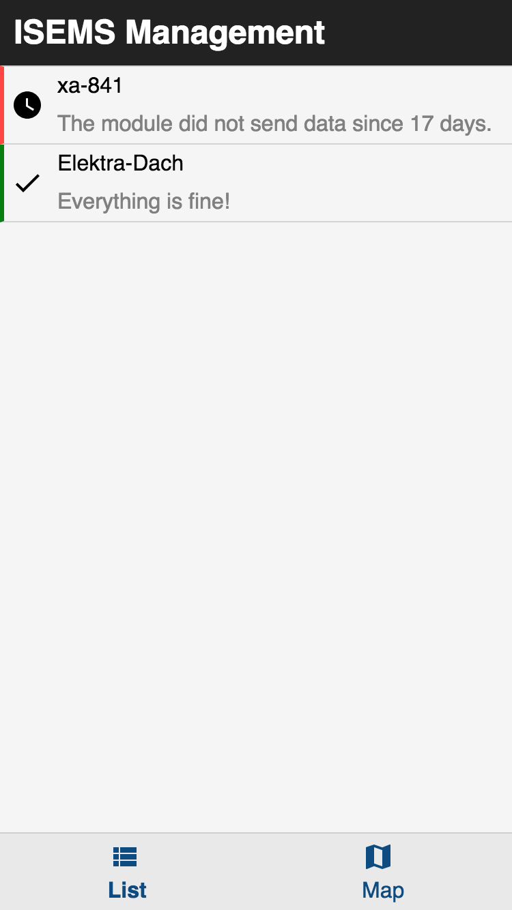
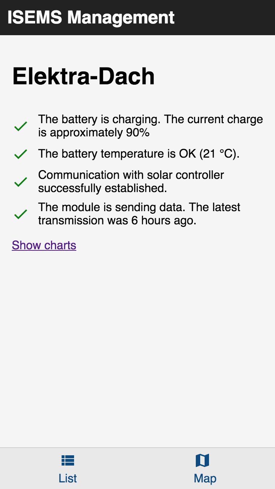
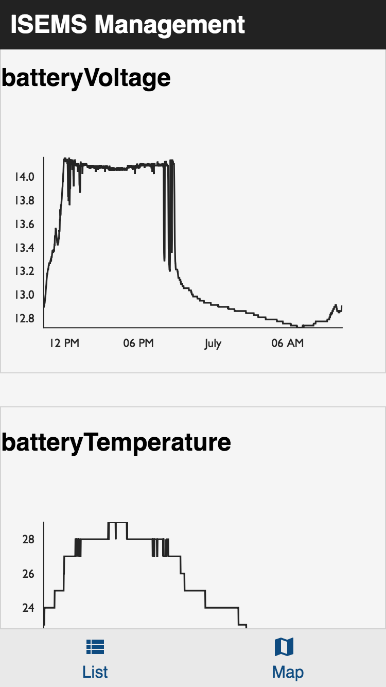

# ISEMS-App [](https://travis-ci.com/ISEMS/isems-app) [](https://codecov.io/gh/ISEMS/isems-app) 

> [!IMPORTANT]  
> This project (being the frontend, along with the [backend](https://github.com/isems/isems-data-collector)) is no 
> longer being maintained and therefore marked as archived. The hardware part of the project lives on though. You
> can find more information on the project (along with an alternative data tarnsport mechanism via MQTT) 
> on the website [isems.de](https://www.isems.de).
 
This is the frontend for the ISEMS project. It's goal is to provide information about the health of 
a solar mesh network in an easily understandable way.

Overview                                                 |  Details                                               | Charts
:-------------------------------------------------------:|:------------------------------------------------------:|:---------------------------------------------------:|
  |   |  


## Install
```bash
yarn install
```

## Running
You should define the `REACT_APP_API_URL` environment variable to tell the app where the server is. 
```bash
env REACT_APP_API_URL=http://localhost:8000 yarn start
```


## Test
```bash
yarn test
```
